# Chart of accounts

General ledger operate on the following accounts, which are of one of the three types: asset, liability or equity.

## Asset accounts
- GENESIS - represents the Genesis supply; this later may (should) be broken into its constituent parts
- BURNED - contra-account of amount of FLR that has been burned
- MINTING_AUTHORIZED - represents FLR authorized to be minted by Flare Foundation constitution
- MINTING_REQUESTED - represents FLR requested to be minted by validators
- MINTED - represents FLR minted by validators
- MINTING_WITHDRAWN - contra-account of FLR withdrawn by minting faucets
- FTSO_REWARD_MANAGER_SUPPLY - represents supply of rewardable inflation
- FTSO_REWARD_MANAGER_EARNED - represents earned rewards not yet claimed
- FTSO_REWARD_MANAGER_CLAIMED - represents all claimed rewards
- FLARE_KEEPER_SELF_DESTRUCT_PROCEEDS - account to receive proceeds if keeper is self-destruct recipient
- FTSO_REWARD_MANAGER_SELF_DESTRUCT_PROCEEDS - account to receive proceeds if Ftso reward manager is self-destruct recipient
- FTSO_REWARD_INFLATION_EXPECTED - account to hold suspense of ftso reward annual inflation approved at annum begin by governance. 
- FTSO_REWARD_MINTING_UNAUTHORIZED - contra-account to net against ftso inflation expected. These two accounts should always net to zero.

## Liability accounts

- FTSO_REWARD_INFLATION_VALIDATOR_PAYABLE - represents FLR owed to the network by the validators to fulfill Ftso reward inflation

## Equity accounts 

- GENESIS_TOKEN - Equity account of flare tokens created at genesis
- FTSO_REWARD_INFLATION_TOKEN - Equity account of flare tokens minted for Ftso inflation rewards
- BURNED_TOKEN - contra-account of burned flare tokens

# Accounting operations

Accounting operations typically credit one account and debit the other.

| Contract | Operation | Debits | Credits |
| --- | --- | --- | --- |
| FtsoInflationAccounting | inflateForAnnum | FTSO_REWARD_INFLATION_EXPECTED | FTSO_REWARD_MINTING_UNAUTHORIZED |
| FtsoInflationAccounting | authorizeMinting | MINTING_AUTHORIZED | FTSO_REWARD_INFLATION_VALIDATOR_PAYABLE |
| FtsoInflationAccounting | receiveMinting | FTSO_REWARD_INFLATION_VALIDATOR_PAYABLE | FTSO_REWARD_INFLATION_TOKEN |
| MintAccounting | requestMinting | MINTING_REQUESTED | MINTING_AUTHORIZED |
| MintAccounting | receiveMinting | MINTED | MINTING_REQUESTED |
| MintAccounting | receiveSelfDestructProceeds | FLARE_KEEPER_SELF_DESTRUCT_PROCEEDS | GENESIS |
| FtsoRewardManagerAccounting | receiveSupply | FTSO_REWARD_MANAGER_SUPPLY | MINTING_WITHDRAWN |
| FtsoRewardManagerAccounting | rewardsEarned | FTSO_REWARD_MANAGER_EARNED | FTSO_REWARD_MANAGER_SUPPLY |
| FtsoRewardManagerAccounting | rewardsExpired | FTSO_REWARD_MANAGER_SUPPLY | FTSO_REWARD_MANAGER_EARNED |
| FtsoRewardManagerAccounting | rewardsClaimed | FTSO_REWARD_MANAGER_CLAIMED | FTSO_REWARD_MANAGER_EARNED |

Source of an arrow indicates crediting an account while the target indicates debiting an account.

```mermaid
graph TD
    FTSO_REWARD_MINTING_UNAUTHORIZED[FTSO_REWARD_MINTING_UNAUTHORIZED] -- inflateForAnnum --> FTSO_REWARD_INFLATION_EXPECTED[FTSO_REWARD_INFLATION_EXPECTED]
    FTSO_REWARD_INFLATION_VALIDATOR_PAYABLE[FTSO_REWARD_INFLATION_VALIDATOR_PAYABLE] -- authorizeMinting --> MINTING_AUTHORIZED[MINTING_AUTHORIZED]
    FTSO_REWARD_INFLATION_TOKEN[FTSO_REWARD_INFLATION_TOKEN] -- receiveMinting --> FTSO_REWARD_INFLATION_VALIDATOR_PAYABLE
    MINTING_AUTHORIZED -- requestMinting --> MINTING_REQUESTED[MINTING_REQUESTED]
    MINTING_REQUESTED -- receiveMinting --> MINTED[MINTED]
    GENESIS[GENESIS] -- receiveSelfDestructProceeds --> FLARE_KEEPER_SELF_DESTRUCT_PROCEEDS[FLARE_KEEPER_SELF_DESTRUCT_PROCEEDS]
    MINTING_WITHDRAWN[MINTING_WITHDRAWN] -- receiveSupply --> FTSO_REWARD_MANAGER_SUPPLY[FTSO_REWARD_MANAGER_SUPPLY]
    FTSO_REWARD_MANAGER_SUPPLY -- rewardsEarned --> FTSO_REWARD_MANAGER_EARNED[FTSO_REWARD_MANAGER_EARNED]
    FTSO_REWARD_MANAGER_EARNED -- rewardsExpired --> FTSO_REWARD_MANAGER_SUPPLY
    FTSO_REWARD_MANAGER_EARNED -- rewardsClaimed --> FTSO_REWARD_MANAGER_CLAIMED
    BURNED[BURNED]
    FTSO_REWARD_MANAGER_SELF_DESTRUCT_PROCEEDS[FTSO_REWARD_MANAGER_SELF_DESTRUCT_PROCEEDS]
    GENESIS_TOKEN[GENESIS_TOKEN]
    BURNED_TOKEN[BURNED_TOKEN]
    classDef asset fill:#D4EDDA,stroke:#555555,stroke-width:2px,color:#000000;
    classDef liability fill:#F8D7DA,stroke:#555555,stroke-width:2px,color:#000000;
    classDef equity fill:#FFF3CD,stroke:#555555,stroke-width:2px,color:#000000;   
    class GENESIS,BURNED,MINTING_AUTHORIZED,MINTING_REQUESTED,MINTED,MINTING_WITHDRAWN asset;
    class FTSO_REWARD_MANAGER_SUPPLY,FTSO_REWARD_MANAGER_EARNED,FTSO_REWARD_MANAGER_CLAIMED asset;
    class FLARE_KEEPER_SELF_DESTRUCT_PROCEEDS,FTSO_REWARD_MANAGER_SELF_DESTRUCT_PROCEEDS asset;
    class FTSO_REWARD_INFLATION_EXPECTED,FTSO_REWARD_MINTING_UNAUTHORIZED asset;
    class FTSO_REWARD_INFLATION_VALIDATOR_PAYABLE liability;
    class GENESIS_TOKEN,FTSO_REWARD_INFLATION_TOKEN,BURNED_TOKEN equity;
```

    

