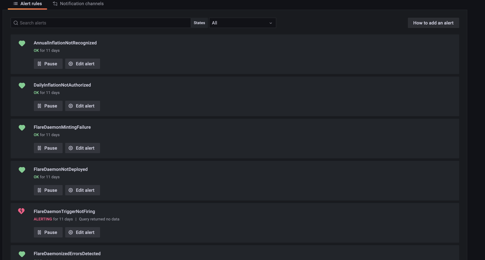
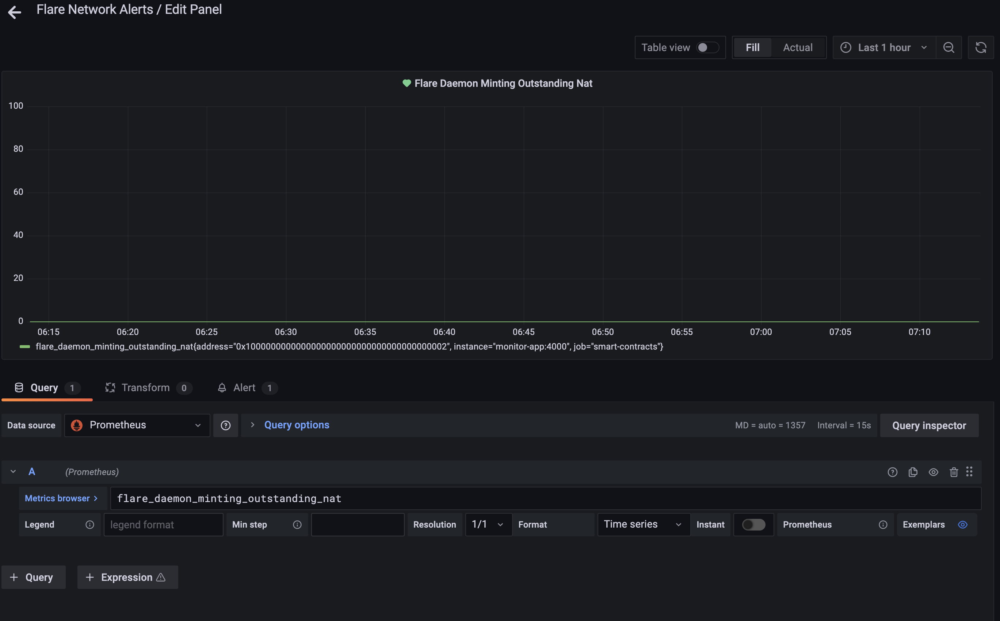
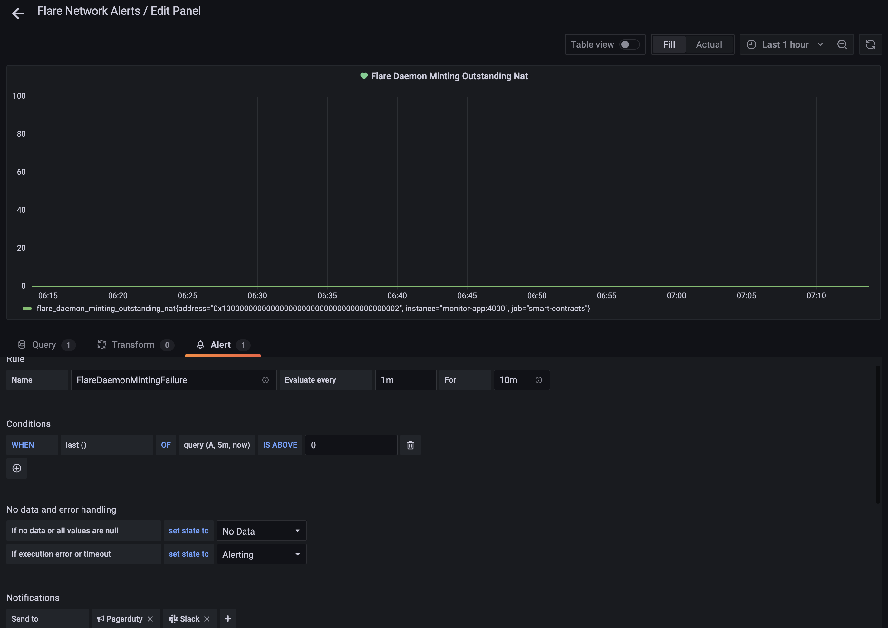

# Flare Network Smart Contract Monitoring

## Overview

This project composes a monitoring solution for the Flare Network smart contract infrastructure. Its purpose is to monitor critical ongoing operations of certain smart contracts and raise alerts if operations are out of spec.

### Architecture

The project is composed and/or dependent on the following components: 
- running Ethereum EVM-based blockchain with exposed JSON-RPC API endpoint
- deployed contracts from the flare-smart-contracts project
- data surfacing
- [Prometheus] - data collection
- [Grafana] - visualization and alerting
- Slack & [Pagerduty] - notification and escalation

#### Running Blockchain

A running EVM-based blockchain should expose a JSON-RPC API. The data surfacing application will make calls through this API to collect monitoring data that will be fed to the data collection application. Smart contracts from the flare-smart-contracts project should already be deployed to the blockchain. Note that this project has been tested with both the hardhat development environment and the Avalanche validator customized for the Flare Network.

#### Data Surfacing

This is a [custom node application](./src/index.ts) that reads data from various smart contracts on the blockchain and surfaces the data for collection by the Prometheus data collection application. Prometheus expects collection data to be in the exposition format defined by the [Prometheus Exposition Format] specification.   

#### Data Collection

The [Prometheus] application server pulls metrics from targets defined within its configuration, on a periodic basis, and stores those metrics as a time series for later viewing and analysis. At its most basic, it consists of a pull engine, a persistent storage engine, and a retrieval engine. A variety of ready-built exporters already exist (including within the Avalanche Go validator application) for operating systems and application servers, making Prometheus a ubiquitous IT Ops time series data collection engine.

#### Visualization and Alerting

The [Grafana] application queries time series data within Prometheus and provides a flexible means to visualize that data through dashboards. One can also define alerting rules with thresholds, alerts from which can be forwarded on through a series of plugins to consuming applications.

#### Notification and Escalation

At present, Grafana is configured to send all alerts to both a Slack channel (currently monitoring-smart-contracts-production) and to [Pagerduty]. The point of sending alerts to Pagerduty is that over time, a sophisticated escalation model can be built for informing the correct teams, at a service-level required time, of alerts that pertain to that teams's span of control, while collecting incidents and resolution for future triage and service level reporting. 

## Data Surfacing Application

### Dependencies
- [Node JS] v16 or better
- [Yarn]
- [Flare Networks smart contracts] in the parent contracts directory

### <a id="RunningInDevelopment"></a>Running In Development ###
- Start hardhat and deploy smart contracts in parent project (in another terminal). Remove the `-k` parameter from the deploy_local_hardhat package.json runner command, so that the hardhat instance will stay running after deployment is complete.
```bash
cd ..
yarn
yarn c
yarn deploy_local_hardhat
```
- Start the data surfacing application.
```bash
yarn start -e 'http://localhost:8545' -c '../deployment/deploys/hardhat.json'
```
- Browse to `http://localhost:4000/metrics`. A page similar to this should display:
```
# HELP flare_daemon_block_holdoffs_remaining The number of block holdoffs remaining
# TYPE flare_daemon_block_holdoffs_remaining gauge
flare_daemon_block_holdoffs_remaining{flare_daemon_address="0x0078371BDeDE8aAc7DeBfFf451B74c5EDB385Af7",daemonized_contract_address="0x8B5B7a6055E54a36fF574bbE40cf2eA68d5554b3"} 0
flare_daemon_block_holdoffs_remaining{flare_daemon_address="0x0078371BDeDE8aAc7DeBfFf451B74c5EDB385Af7",daemonized_contract_address="0x5A0773Ff307Bf7C71a832dBB5312237fD3437f9F"} 0

# HELP block_number The chain's last block number
# TYPE block_number gauge
block_number 88

# HELP block_number_ts The chain's last block number timestamp
# TYPE block_number_ts gauge
block_number_ts 1609459376

# HELP inflation_current_annum_end_time_stamp The end timestamp of the current inflation annum
# TYPE inflation_current_annum_end_time_stamp gauge
inflation_current_annum_end_time_stamp{address="0x8B5B7a6055E54a36fF574bbE40cf2eA68d5554b3"} 0

# HELP inflation_current_balance_nat The current balance of the Inflation contract in native token units
# TYPE inflation_current_balance_nat gauge
inflation_current_balance_nat{address="0x8B5B7a6055E54a36fF574bbE40cf2eA68d5554b3"} 0

# HELP ftso_reward_manager_current_balance_nat The current balance of the FtsoRewardManager contract in native token units
# TYPE ftso_reward_manager_current_balance_nat gauge
ftso_reward_manager_current_balance_nat{address="0x2D8553F9ddA85A9B3259F6Bf26911364B85556F5"} 0

# HELP inflation_last_authorization_ts The timestamp of the last inflation authorization
# TYPE inflation_last_authorization_ts gauge
inflation_last_authorization_ts{address="0x8B5B7a6055E54a36fF574bbE40cf2eA68d5554b3"} 0

# HELP flare_daemon_minting_outstanding_nat The expected amount of native token expected to be minted
# TYPE flare_daemon_minting_outstanding_nat gauge
flare_daemon_minting_outstanding_nat{address="0x0078371BDeDE8aAc7DeBfFf451B74c5EDB385Af7"} 0

# HELP inflation_reward_epoch_start_ts The timestamp of the first reward epoch that is to begin inflation authorization
# TYPE inflation_reward_epoch_start_ts gauge
inflation_reward_epoch_start_ts{address="0x8B5B7a6055E54a36fF574bbE40cf2eA68d5554b3"} 1609459234

# HELP flare_daemon_system_last_triggered_at The last block executed by the trigger method of the FlareDaemon
# TYPE flare_daemon_system_last_triggered_at gauge
flare_daemon_system_last_triggered_at{address="0x0078371BDeDE8aAc7DeBfFf451B74c5EDB385Af7"} 70

# HELP flare_daemon_system_last_triggered_at_ts The timestamp of the last block executed by the trigger method of the FlareDaemon
# TYPE flare_daemon_system_last_triggered_at_ts gauge
flare_daemon_system_last_triggered_at_ts{address="0x0078371BDeDE8aAc7DeBfFf451B74c5EDB385Af7"} 1609459302

# HELP flare_daemon_total_daemonized_errors The total number of daemonized errors from the last errored block
# TYPE flare_daemon_total_daemonized_errors gauge
flare_daemon_total_daemonized_errors{address="0x0078371BDeDE8aAc7DeBfFf451B74c5EDB385Af7"} 0

# HELP ftso_reward_manager_total_unclaimed_awards_outstanding_nat The total amount of unclaimed ftso awards in native token units
# TYPE ftso_reward_manager_total_unclaimed_awards_outstanding_nat gauge
ftso_reward_manager_total_unclaimed_awards_outstanding_nat{address="0x2D8553F9ddA85A9B3259F6Bf26911364B85556F5"} 0

# HELP monitor_app_metric_response_time_seconds Histogram of metric collection response time in seconds
# TYPE monitor_app_metric_response_time_seconds histogram
monitor_app_metric_response_time_seconds_bucket{le="0.005",metric="block_number"} 0
monitor_app_metric_response_time_seconds_bucket{le="0.01",metric="block_number"} 0
monitor_app_metric_response_time_seconds_bucket{le="0.025",metric="block_number"} 2
monitor_app_metric_response_time_seconds_bucket{le="0.05",metric="block_number"} 3
monitor_app_metric_response_time_seconds_bucket{le="0.1",metric="block_number"} 3
monitor_app_metric_response_time_seconds_bucket{le="0.25",metric="block_number"} 3
monitor_app_metric_response_time_seconds_bucket{le="0.5",metric="block_number"} 3
monitor_app_metric_response_time_seconds_bucket{le="1",metric="block_number"} 3
monitor_app_metric_response_time_seconds_bucket{le="2.5",metric="block_number"} 3
monitor_app_metric_response_time_seconds_bucket{le="5",metric="block_number"} 3
monitor_app_metric_response_time_seconds_bucket{le="10",metric="block_number"} 3
monitor_app_metric_response_time_seconds_bucket{le="+Inf",metric="block_number"} 3
monitor_app_metric_response_time_seconds_sum{metric="block_number"} 0.073940337
monitor_app_metric_response_time_seconds_count{metric="block_number"} 3
monitor_app_metric_response_time_seconds_bucket{le="0.005",metric="block_number_ts"} 0
monitor_app_metric_response_time_seconds_bucket{le="0.01",metric="block_number_ts"} 0
monitor_app_metric_response_time_seconds_bucket{le="0.025",metric="block_number_ts"} 2
monitor_app_metric_response_time_seconds_bucket{le="0.05",metric="block_number_ts"} 3
monitor_app_metric_response_time_seconds_bucket{le="0.1",metric="block_number_ts"} 3
monitor_app_metric_response_time_seconds_bucket{le="0.25",metric="block_number_ts"} 3
monitor_app_metric_response_time_seconds_bucket{le="0.5",metric="block_number_ts"} 3
monitor_app_metric_response_time_seconds_bucket{le="1",metric="block_number_ts"} 3
monitor_app_metric_response_time_seconds_bucket{le="2.5",metric="block_number_ts"} 3
monitor_app_metric_response_time_seconds_bucket{le="5",metric="block_number_ts"} 3
monitor_app_metric_response_time_seconds_bucket{le="10",metric="block_number_ts"} 3
monitor_app_metric_response_time_seconds_bucket{le="+Inf",metric="block_number_ts"} 3
monitor_app_metric_response_time_seconds_sum{metric="block_number_ts"} 0.07675902600000001
monitor_app_metric_response_time_seconds_count{metric="block_number_ts"} 3
monitor_app_metric_response_time_seconds_bucket{le="0.005",metric="inflation_current_balance_nat"} 0
monitor_app_metric_response_time_seconds_bucket{le="0.01",metric="inflation_current_balance_nat"} 0
monitor_app_metric_response_time_seconds_bucket{le="0.025",metric="inflation_current_balance_nat"} 2
monitor_app_metric_response_time_seconds_bucket{le="0.05",metric="inflation_current_balance_nat"} 3
monitor_app_metric_response_time_seconds_bucket{le="0.1",metric="inflation_current_balance_nat"} 3
monitor_app_metric_response_time_seconds_bucket{le="0.25",metric="inflation_current_balance_nat"} 3
monitor_app_metric_response_time_seconds_bucket{le="0.5",metric="inflation_current_balance_nat"} 3
monitor_app_metric_response_time_seconds_bucket{le="1",metric="inflation_current_balance_nat"} 3
monitor_app_metric_response_time_seconds_bucket{le="2.5",metric="inflation_current_balance_nat"} 3
monitor_app_metric_response_time_seconds_bucket{le="5",metric="inflation_current_balance_nat"} 3
monitor_app_metric_response_time_seconds_bucket{le="10",metric="inflation_current_balance_nat"} 3
monitor_app_metric_response_time_seconds_bucket{le="+Inf",metric="inflation_current_balance_nat"} 3
monitor_app_metric_response_time_seconds_sum{metric="inflation_current_balance_nat"} 0.079249206
monitor_app_metric_response_time_seconds_count{metric="inflation_current_balance_nat"} 3
monitor_app_metric_response_time_seconds_bucket{le="0.005",metric="ftso_reward_manager_current_balance_nat"} 0
monitor_app_metric_response_time_seconds_bucket{le="0.01",metric="ftso_reward_manager_current_balance_nat"} 0
monitor_app_metric_response_time_seconds_bucket{le="0.025",metric="ftso_reward_manager_current_balance_nat"} 2
monitor_app_metric_response_time_seconds_bucket{le="0.05",metric="ftso_reward_manager_current_balance_nat"} 3
monitor_app_metric_response_time_seconds_bucket{le="0.1",metric="ftso_reward_manager_current_balance_nat"} 3
monitor_app_metric_response_time_seconds_bucket{le="0.25",metric="ftso_reward_manager_current_balance_nat"} 3
monitor_app_metric_response_time_seconds_bucket{le="0.5",metric="ftso_reward_manager_current_balance_nat"} 3
monitor_app_metric_response_time_seconds_bucket{le="1",metric="ftso_reward_manager_current_balance_nat"} 3
monitor_app_metric_response_time_seconds_bucket{le="2.5",metric="ftso_reward_manager_current_balance_nat"} 3
monitor_app_metric_response_time_seconds_bucket{le="5",metric="ftso_reward_manager_current_balance_nat"} 3
monitor_app_metric_response_time_seconds_bucket{le="10",metric="ftso_reward_manager_current_balance_nat"} 3
monitor_app_metric_response_time_seconds_bucket{le="+Inf",metric="ftso_reward_manager_current_balance_nat"} 3
monitor_app_metric_response_time_seconds_sum{metric="ftso_reward_manager_current_balance_nat"} 0.079818623
monitor_app_metric_response_time_seconds_count{metric="ftso_reward_manager_current_balance_nat"} 3
monitor_app_metric_response_time_seconds_bucket{le="0.005",metric="flare_daemon_transaction_count"} 0
monitor_app_metric_response_time_seconds_bucket{le="0.01",metric="flare_daemon_transaction_count"} 0
monitor_app_metric_response_time_seconds_bucket{le="0.025",metric="flare_daemon_transaction_count"} 2
monitor_app_metric_response_time_seconds_bucket{le="0.05",metric="flare_daemon_transaction_count"} 3
monitor_app_metric_response_time_seconds_bucket{le="0.1",metric="flare_daemon_transaction_count"} 3
monitor_app_metric_response_time_seconds_bucket{le="0.25",metric="flare_daemon_transaction_count"} 3
monitor_app_metric_response_time_seconds_bucket{le="0.5",metric="flare_daemon_transaction_count"} 3
monitor_app_metric_response_time_seconds_bucket{le="1",metric="flare_daemon_transaction_count"} 3
monitor_app_metric_response_time_seconds_bucket{le="2.5",metric="flare_daemon_transaction_count"} 3
monitor_app_metric_response_time_seconds_bucket{le="5",metric="flare_daemon_transaction_count"} 3
monitor_app_metric_response_time_seconds_bucket{le="10",metric="flare_daemon_transaction_count"} 3
monitor_app_metric_response_time_seconds_bucket{le="+Inf",metric="flare_daemon_transaction_count"} 3
monitor_app_metric_response_time_seconds_sum{metric="flare_daemon_transaction_count"} 0.07931631600000001
monitor_app_metric_response_time_seconds_count{metric="flare_daemon_transaction_count"} 3
monitor_app_metric_response_time_seconds_bucket{le="0.005",metric="inflation_transaction_count"} 0
monitor_app_metric_response_time_seconds_bucket{le="0.01",metric="inflation_transaction_count"} 0
monitor_app_metric_response_time_seconds_bucket{le="0.025",metric="inflation_transaction_count"} 2
monitor_app_metric_response_time_seconds_bucket{le="0.05",metric="inflation_transaction_count"} 3
monitor_app_metric_response_time_seconds_bucket{le="0.1",metric="inflation_transaction_count"} 3
monitor_app_metric_response_time_seconds_bucket{le="0.25",metric="inflation_transaction_count"} 3
monitor_app_metric_response_time_seconds_bucket{le="0.5",metric="inflation_transaction_count"} 3
monitor_app_metric_response_time_seconds_bucket{le="1",metric="inflation_transaction_count"} 3
monitor_app_metric_response_time_seconds_bucket{le="2.5",metric="inflation_transaction_count"} 3
monitor_app_metric_response_time_seconds_bucket{le="5",metric="inflation_transaction_count"} 3
monitor_app_metric_response_time_seconds_bucket{le="10",metric="inflation_transaction_count"} 3
monitor_app_metric_response_time_seconds_bucket{le="+Inf",metric="inflation_transaction_count"} 3
monitor_app_metric_response_time_seconds_sum{metric="inflation_transaction_count"} 0.081034516
monitor_app_metric_response_time_seconds_count{metric="inflation_transaction_count"} 3
monitor_app_metric_response_time_seconds_bucket{le="0.005",metric="ftso_reward_manager_transaction_count"} 0
monitor_app_metric_response_time_seconds_bucket{le="0.01",metric="ftso_reward_manager_transaction_count"} 0
monitor_app_metric_response_time_seconds_bucket{le="0.025",metric="ftso_reward_manager_transaction_count"} 2
monitor_app_metric_response_time_seconds_bucket{le="0.05",metric="ftso_reward_manager_transaction_count"} 3
monitor_app_metric_response_time_seconds_bucket{le="0.1",metric="ftso_reward_manager_transaction_count"} 3
monitor_app_metric_response_time_seconds_bucket{le="0.25",metric="ftso_reward_manager_transaction_count"} 3
monitor_app_metric_response_time_seconds_bucket{le="0.5",metric="ftso_reward_manager_transaction_count"} 3
monitor_app_metric_response_time_seconds_bucket{le="1",metric="ftso_reward_manager_transaction_count"} 3
monitor_app_metric_response_time_seconds_bucket{le="2.5",metric="ftso_reward_manager_transaction_count"} 3
monitor_app_metric_response_time_seconds_bucket{le="5",metric="ftso_reward_manager_transaction_count"} 3
monitor_app_metric_response_time_seconds_bucket{le="10",metric="ftso_reward_manager_transaction_count"} 3
monitor_app_metric_response_time_seconds_bucket{le="+Inf",metric="ftso_reward_manager_transaction_count"} 3
monitor_app_metric_response_time_seconds_sum{metric="ftso_reward_manager_transaction_count"} 0.08297021
monitor_app_metric_response_time_seconds_count{metric="ftso_reward_manager_transaction_count"} 3
monitor_app_metric_response_time_seconds_bucket{le="0.005",metric="flare_daemon_block_holdoffs_remaining"} 0
monitor_app_metric_response_time_seconds_bucket{le="0.01",metric="flare_daemon_block_holdoffs_remaining"} 1
monitor_app_metric_response_time_seconds_bucket{le="0.025",metric="flare_daemon_block_holdoffs_remaining"} 3
monitor_app_metric_response_time_seconds_bucket{le="0.05",metric="flare_daemon_block_holdoffs_remaining"} 8
monitor_app_metric_response_time_seconds_bucket{le="0.1",metric="flare_daemon_block_holdoffs_remaining"} 9
monitor_app_metric_response_time_seconds_bucket{le="0.25",metric="flare_daemon_block_holdoffs_remaining"} 9
monitor_app_metric_response_time_seconds_bucket{le="0.5",metric="flare_daemon_block_holdoffs_remaining"} 9
monitor_app_metric_response_time_seconds_bucket{le="1",metric="flare_daemon_block_holdoffs_remaining"} 9
monitor_app_metric_response_time_seconds_bucket{le="2.5",metric="flare_daemon_block_holdoffs_remaining"} 9
monitor_app_metric_response_time_seconds_bucket{le="5",metric="flare_daemon_block_holdoffs_remaining"} 9
monitor_app_metric_response_time_seconds_bucket{le="10",metric="flare_daemon_block_holdoffs_remaining"} 9
monitor_app_metric_response_time_seconds_bucket{le="+Inf",metric="flare_daemon_block_holdoffs_remaining"} 9
monitor_app_metric_response_time_seconds_sum{metric="flare_daemon_block_holdoffs_remaining"} 0.26068690099999997
monitor_app_metric_response_time_seconds_count{metric="flare_daemon_block_holdoffs_remaining"} 9
monitor_app_metric_response_time_seconds_bucket{le="0.005",metric="inflation_current_annum_end_time_stamp"} 0
monitor_app_metric_response_time_seconds_bucket{le="0.01",metric="inflation_current_annum_end_time_stamp"} 0
monitor_app_metric_response_time_seconds_bucket{le="0.025",metric="inflation_current_annum_end_time_stamp"} 0
monitor_app_metric_response_time_seconds_bucket{le="0.05",metric="inflation_current_annum_end_time_stamp"} 2
monitor_app_metric_response_time_seconds_bucket{le="0.1",metric="inflation_current_annum_end_time_stamp"} 3
monitor_app_metric_response_time_seconds_bucket{le="0.25",metric="inflation_current_annum_end_time_stamp"} 3
monitor_app_metric_response_time_seconds_bucket{le="0.5",metric="inflation_current_annum_end_time_stamp"} 3
monitor_app_metric_response_time_seconds_bucket{le="1",metric="inflation_current_annum_end_time_stamp"} 3
monitor_app_metric_response_time_seconds_bucket{le="2.5",metric="inflation_current_annum_end_time_stamp"} 3
monitor_app_metric_response_time_seconds_bucket{le="5",metric="inflation_current_annum_end_time_stamp"} 3
monitor_app_metric_response_time_seconds_bucket{le="10",metric="inflation_current_annum_end_time_stamp"} 3
monitor_app_metric_response_time_seconds_bucket{le="+Inf",metric="inflation_current_annum_end_time_stamp"} 3
monitor_app_metric_response_time_seconds_sum{metric="inflation_current_annum_end_time_stamp"} 0.123583858
monitor_app_metric_response_time_seconds_count{metric="inflation_current_annum_end_time_stamp"} 3
monitor_app_metric_response_time_seconds_bucket{le="0.005",metric="inflation_last_authorization_ts"} 0
monitor_app_metric_response_time_seconds_bucket{le="0.01",metric="inflation_last_authorization_ts"} 0
monitor_app_metric_response_time_seconds_bucket{le="0.025",metric="inflation_last_authorization_ts"} 0
monitor_app_metric_response_time_seconds_bucket{le="0.05",metric="inflation_last_authorization_ts"} 2
monitor_app_metric_response_time_seconds_bucket{le="0.1",metric="inflation_last_authorization_ts"} 3
monitor_app_metric_response_time_seconds_bucket{le="0.25",metric="inflation_last_authorization_ts"} 3
monitor_app_metric_response_time_seconds_bucket{le="0.5",metric="inflation_last_authorization_ts"} 3
monitor_app_metric_response_time_seconds_bucket{le="1",metric="inflation_last_authorization_ts"} 3
monitor_app_metric_response_time_seconds_bucket{le="2.5",metric="inflation_last_authorization_ts"} 3
monitor_app_metric_response_time_seconds_bucket{le="5",metric="inflation_last_authorization_ts"} 3
monitor_app_metric_response_time_seconds_bucket{le="10",metric="inflation_last_authorization_ts"} 3
monitor_app_metric_response_time_seconds_bucket{le="+Inf",metric="inflation_last_authorization_ts"} 3
monitor_app_metric_response_time_seconds_sum{metric="inflation_last_authorization_ts"} 0.14195006599999999
monitor_app_metric_response_time_seconds_count{metric="inflation_last_authorization_ts"} 3
monitor_app_metric_response_time_seconds_bucket{le="0.005",metric="inflation_reward_epoch_start_ts"} 0
monitor_app_metric_response_time_seconds_bucket{le="0.01",metric="inflation_reward_epoch_start_ts"} 0
monitor_app_metric_response_time_seconds_bucket{le="0.025",metric="inflation_reward_epoch_start_ts"} 0
monitor_app_metric_response_time_seconds_bucket{le="0.05",metric="inflation_reward_epoch_start_ts"} 2
monitor_app_metric_response_time_seconds_bucket{le="0.1",metric="inflation_reward_epoch_start_ts"} 3
monitor_app_metric_response_time_seconds_bucket{le="0.25",metric="inflation_reward_epoch_start_ts"} 3
monitor_app_metric_response_time_seconds_bucket{le="0.5",metric="inflation_reward_epoch_start_ts"} 3
monitor_app_metric_response_time_seconds_bucket{le="1",metric="inflation_reward_epoch_start_ts"} 3
monitor_app_metric_response_time_seconds_bucket{le="2.5",metric="inflation_reward_epoch_start_ts"} 3
monitor_app_metric_response_time_seconds_bucket{le="5",metric="inflation_reward_epoch_start_ts"} 3
monitor_app_metric_response_time_seconds_bucket{le="10",metric="inflation_reward_epoch_start_ts"} 3
monitor_app_metric_response_time_seconds_bucket{le="+Inf",metric="inflation_reward_epoch_start_ts"} 3
monitor_app_metric_response_time_seconds_sum{metric="inflation_reward_epoch_start_ts"} 0.15500835799999998
monitor_app_metric_response_time_seconds_count{metric="inflation_reward_epoch_start_ts"} 3
monitor_app_metric_response_time_seconds_bucket{le="0.005",metric="flare_daemon_system_last_triggered_at"} 0
monitor_app_metric_response_time_seconds_bucket{le="0.01",metric="flare_daemon_system_last_triggered_at"} 0
monitor_app_metric_response_time_seconds_bucket{le="0.025",metric="flare_daemon_system_last_triggered_at"} 0
monitor_app_metric_response_time_seconds_bucket{le="0.05",metric="flare_daemon_system_last_triggered_at"} 2
monitor_app_metric_response_time_seconds_bucket{le="0.1",metric="flare_daemon_system_last_triggered_at"} 3
monitor_app_metric_response_time_seconds_bucket{le="0.25",metric="flare_daemon_system_last_triggered_at"} 3
monitor_app_metric_response_time_seconds_bucket{le="0.5",metric="flare_daemon_system_last_triggered_at"} 3
monitor_app_metric_response_time_seconds_bucket{le="1",metric="flare_daemon_system_last_triggered_at"} 3
monitor_app_metric_response_time_seconds_bucket{le="2.5",metric="flare_daemon_system_last_triggered_at"} 3
monitor_app_metric_response_time_seconds_bucket{le="5",metric="flare_daemon_system_last_triggered_at"} 3
monitor_app_metric_response_time_seconds_bucket{le="10",metric="flare_daemon_system_last_triggered_at"} 3
monitor_app_metric_response_time_seconds_bucket{le="+Inf",metric="flare_daemon_system_last_triggered_at"} 3
monitor_app_metric_response_time_seconds_sum{metric="flare_daemon_system_last_triggered_at"} 0.166130226
monitor_app_metric_response_time_seconds_count{metric="flare_daemon_system_last_triggered_at"} 3
monitor_app_metric_response_time_seconds_bucket{le="0.005",metric="flare_daemon_total_daemonized_errors"} 0
monitor_app_metric_response_time_seconds_bucket{le="0.01",metric="flare_daemon_total_daemonized_errors"} 0
monitor_app_metric_response_time_seconds_bucket{le="0.025",metric="flare_daemon_total_daemonized_errors"} 0
monitor_app_metric_response_time_seconds_bucket{le="0.05",metric="flare_daemon_total_daemonized_errors"} 0
monitor_app_metric_response_time_seconds_bucket{le="0.1",metric="flare_daemon_total_daemonized_errors"} 3
monitor_app_metric_response_time_seconds_bucket{le="0.25",metric="flare_daemon_total_daemonized_errors"} 3
monitor_app_metric_response_time_seconds_bucket{le="0.5",metric="flare_daemon_total_daemonized_errors"} 3
monitor_app_metric_response_time_seconds_bucket{le="1",metric="flare_daemon_total_daemonized_errors"} 3
monitor_app_metric_response_time_seconds_bucket{le="2.5",metric="flare_daemon_total_daemonized_errors"} 3
monitor_app_metric_response_time_seconds_bucket{le="5",metric="flare_daemon_total_daemonized_errors"} 3
monitor_app_metric_response_time_seconds_bucket{le="10",metric="flare_daemon_total_daemonized_errors"} 3
monitor_app_metric_response_time_seconds_bucket{le="+Inf",metric="flare_daemon_total_daemonized_errors"} 3
monitor_app_metric_response_time_seconds_sum{metric="flare_daemon_total_daemonized_errors"} 0.19021337400000002
monitor_app_metric_response_time_seconds_count{metric="flare_daemon_total_daemonized_errors"} 3
monitor_app_metric_response_time_seconds_bucket{le="0.005",metric="flare_daemon_minting_outstanding_nat"} 0
monitor_app_metric_response_time_seconds_bucket{le="0.01",metric="flare_daemon_minting_outstanding_nat"} 0
monitor_app_metric_response_time_seconds_bucket{le="0.025",metric="flare_daemon_minting_outstanding_nat"} 0
monitor_app_metric_response_time_seconds_bucket{le="0.05",metric="flare_daemon_minting_outstanding_nat"} 0
monitor_app_metric_response_time_seconds_bucket{le="0.1",metric="flare_daemon_minting_outstanding_nat"} 3
monitor_app_metric_response_time_seconds_bucket{le="0.25",metric="flare_daemon_minting_outstanding_nat"} 3
monitor_app_metric_response_time_seconds_bucket{le="0.5",metric="flare_daemon_minting_outstanding_nat"} 3
monitor_app_metric_response_time_seconds_bucket{le="1",metric="flare_daemon_minting_outstanding_nat"} 3
monitor_app_metric_response_time_seconds_bucket{le="2.5",metric="flare_daemon_minting_outstanding_nat"} 3
monitor_app_metric_response_time_seconds_bucket{le="5",metric="flare_daemon_minting_outstanding_nat"} 3
monitor_app_metric_response_time_seconds_bucket{le="10",metric="flare_daemon_minting_outstanding_nat"} 3
monitor_app_metric_response_time_seconds_bucket{le="+Inf",metric="flare_daemon_minting_outstanding_nat"} 3
monitor_app_metric_response_time_seconds_sum{metric="flare_daemon_minting_outstanding_nat"} 0.23067125
monitor_app_metric_response_time_seconds_count{metric="flare_daemon_minting_outstanding_nat"} 3
monitor_app_metric_response_time_seconds_bucket{le="0.005",metric="flare_daemon_system_last_triggered_at_ts"} 0
monitor_app_metric_response_time_seconds_bucket{le="0.01",metric="flare_daemon_system_last_triggered_at_ts"} 0
monitor_app_metric_response_time_seconds_bucket{le="0.025",metric="flare_daemon_system_last_triggered_at_ts"} 0
monitor_app_metric_response_time_seconds_bucket{le="0.05",metric="flare_daemon_system_last_triggered_at_ts"} 0
monitor_app_metric_response_time_seconds_bucket{le="0.1",metric="flare_daemon_system_last_triggered_at_ts"} 3
monitor_app_metric_response_time_seconds_bucket{le="0.25",metric="flare_daemon_system_last_triggered_at_ts"} 3
monitor_app_metric_response_time_seconds_bucket{le="0.5",metric="flare_daemon_system_last_triggered_at_ts"} 3
monitor_app_metric_response_time_seconds_bucket{le="1",metric="flare_daemon_system_last_triggered_at_ts"} 3
monitor_app_metric_response_time_seconds_bucket{le="2.5",metric="flare_daemon_system_last_triggered_at_ts"} 3
monitor_app_metric_response_time_seconds_bucket{le="5",metric="flare_daemon_system_last_triggered_at_ts"} 3
monitor_app_metric_response_time_seconds_bucket{le="10",metric="flare_daemon_system_last_triggered_at_ts"} 3
monitor_app_metric_response_time_seconds_bucket{le="+Inf",metric="flare_daemon_system_last_triggered_at_ts"} 3
monitor_app_metric_response_time_seconds_sum{metric="flare_daemon_system_last_triggered_at_ts"} 0.23116901099999998
monitor_app_metric_response_time_seconds_count{metric="flare_daemon_system_last_triggered_at_ts"} 3
monitor_app_metric_response_time_seconds_bucket{le="0.005",metric="ftso_reward_manager_total_unclaimed_awards_outstanding_nat"} 0
monitor_app_metric_response_time_seconds_bucket{le="0.01",metric="ftso_reward_manager_total_unclaimed_awards_outstanding_nat"} 0
monitor_app_metric_response_time_seconds_bucket{le="0.025",metric="ftso_reward_manager_total_unclaimed_awards_outstanding_nat"} 0
monitor_app_metric_response_time_seconds_bucket{le="0.05",metric="ftso_reward_manager_total_unclaimed_awards_outstanding_nat"} 0
monitor_app_metric_response_time_seconds_bucket{le="0.1",metric="ftso_reward_manager_total_unclaimed_awards_outstanding_nat"} 2
monitor_app_metric_response_time_seconds_bucket{le="0.25",metric="ftso_reward_manager_total_unclaimed_awards_outstanding_nat"} 3
monitor_app_metric_response_time_seconds_bucket{le="0.5",metric="ftso_reward_manager_total_unclaimed_awards_outstanding_nat"} 3
monitor_app_metric_response_time_seconds_bucket{le="1",metric="ftso_reward_manager_total_unclaimed_awards_outstanding_nat"} 3
monitor_app_metric_response_time_seconds_bucket{le="2.5",metric="ftso_reward_manager_total_unclaimed_awards_outstanding_nat"} 3
monitor_app_metric_response_time_seconds_bucket{le="5",metric="ftso_reward_manager_total_unclaimed_awards_outstanding_nat"} 3
monitor_app_metric_response_time_seconds_bucket{le="10",metric="ftso_reward_manager_total_unclaimed_awards_outstanding_nat"} 3
monitor_app_metric_response_time_seconds_bucket{le="+Inf",metric="ftso_reward_manager_total_unclaimed_awards_outstanding_nat"} 3
monitor_app_metric_response_time_seconds_sum{metric="ftso_reward_manager_total_unclaimed_awards_outstanding_nat"} 0.262382429
monitor_app_metric_response_time_seconds_count{metric="ftso_reward_manager_total_unclaimed_awards_outstanding_nat"} 3

# HELP flare_daemon_transaction_count The transaction count of the FlareDaemon contract
# TYPE flare_daemon_transaction_count gauge
flare_daemon_transaction_count{address="0x0078371BDeDE8aAc7DeBfFf451B74c5EDB385Af7"} 1

# HELP inflation_transaction_count The transaction count of the Inflation contract
# TYPE inflation_transaction_count gauge
inflation_transaction_count{address="0x8B5B7a6055E54a36fF574bbE40cf2eA68d5554b3"} 1

# HELP ftso_reward_manager_transaction_count The transaction count of the FtsoRewardManager contract
# TYPE ftso_reward_manager_transaction_count gauge
ftso_reward_manager_transaction_count{address="0x2D8553F9ddA85A9B3259F6Bf26911364B85556F5"} 1

# HELP monitor_app_http_response_time_seconds Histogram of request response time in seconds
# TYPE monitor_app_http_response_time_seconds histogram
monitor_app_http_response_time_seconds_bucket{le="0.005",code="200",path="/metrics"} 0
monitor_app_http_response_time_seconds_bucket{le="0.01",code="200",path="/metrics"} 0
monitor_app_http_response_time_seconds_bucket{le="0.025",code="200",path="/metrics"} 0
monitor_app_http_response_time_seconds_bucket{le="0.05",code="200",path="/metrics"} 0
monitor_app_http_response_time_seconds_bucket{le="0.1",code="200",path="/metrics"} 2
monitor_app_http_response_time_seconds_bucket{le="0.25",code="200",path="/metrics"} 3
monitor_app_http_response_time_seconds_bucket{le="0.5",code="200",path="/metrics"} 3
monitor_app_http_response_time_seconds_bucket{le="1",code="200",path="/metrics"} 3
monitor_app_http_response_time_seconds_bucket{le="2.5",code="200",path="/metrics"} 3
monitor_app_http_response_time_seconds_bucket{le="5",code="200",path="/metrics"} 3
monitor_app_http_response_time_seconds_bucket{le="10",code="200",path="/metrics"} 3
monitor_app_http_response_time_seconds_bucket{le="+Inf",code="200",path="/metrics"} 3
monitor_app_http_response_time_seconds_sum{code="200",path="/metrics"} 0.270954682
monitor_app_http_response_time_seconds_count{code="200",path="/metrics"} 3
```

### Command Line

The application takes the following arguments when starting:
```
Options:
      --help       Show help                                           [boolean]
      --version    Show version number                                 [boolean]
  -e, --endpoint   The url of the endpoint for chain RPC calls.
                                                             [string] [required]
  -c, --contracts  The contract addresses file in JSON format of Flare Networks
                   Ftso deployment.                          [string] [required]
  -p, --port       TCP port of prometheus scrape server to be started
                                                        [number] [default: 4000]
  -i, --chainid    The chain id to connect to; defaults hardhat local node
                                                       [number] [default: 31337]

Missing required arguments: e, c
```
Note that you must provide the JSON-RPC fully qualified URL endpoint of the blockchain with the `-e` parameter and the location of the smart contract address list via the `-c` parameter, as output by the deploy script (the default location for running in development is `../deployment/deploys/hardhat.json`).

### Environment

A signing account private key address is required for the data surfacing application to function, however, only calls are made to the blockchain, so no gas is expended. That private key is specified in a `.env` file using the `MONITOR_PRIVATE_KEY` key name. An example template file is located in [.env-example]. Also note that if the `NODE_ENV` environment variable is set to `production`, all command line args can be read from the `.env` file, effectively hiding them from `ps` commands and the like, for an extra measure of security on the node running the application.

### Data Collection Specifics

The metrics collected are defined in the `./src/metrics` directory. Metric collection usually consists of smart contract or blockchain call functions, reading data from smart contracts or the blockchain itself. Those call functions are proxied through wrapper classes, generated by typechain, against the compiled smart contracts (using the ABI, of which the build process takes care of creating for you automatically assuming the smart contract code lives in the parent contracts subdirectory).

There are several [Prometheus Metric Types] that can be used to represent various types of metric data. In order to format the output data of the metric in accordance with the [Prometheus Exposition Format], the library [prom-client] takes care of emitting metric data in the correct format. Thus, each metric collector generally follows the pattern of reading data from the blockchain and then calling [prom-client] to output the data using the appropriate Prometheus metric type. Note that each metric collection function takes as input the dependencies required of it to perform the smart contract fetch so that the function can be easily unit tested (with mocks). For the Gauge and Counter types, one implements the `collect()` function, which will then be called automatically upon request of the web page.

## Alerting

Raw metric data collected by [Prometheus] by calling the data surfacing application web page is of little use unless converted into actionable alerts. [Grafana] is used to define alert rules and contains an engine that will issue alerts to flexible plugins that can take action depending on the nature/capabilities of the plugin. It can be as simple as posting a message on a Slack channel, or as sophisticated as routing an issue to a specific group based on one more alerts firing conditionally over time based on correlation rules, like within Pagerduty. Both of these examples are configured for alerts emanating from this monitoring application. It is the responsibility of the consuming application to associate a severity to alerts (if that is even a concept supported). [Grafana]'s only job is to determine whether alerts should fire or not. [Grafana] also has a sophisticated visualization capability, but that is currently only of secondary use in this monitoring implementation. Further work should be done to build out dashboards that can give a visual snapshot of smart contract health.

### <a id="AlertDefinitions"></a>Configured Alerts And Their Meaning ###

| Alert | Trigger | Meaning |
|-------|---------|---------|
| AnnualInflationNotRecognized | if the current time is an hour older than the current annum and rewarding has started | inflation annum is not rolling over |
| DailyInflationNotAuthorized | if the difference between the current block number timestamp and last daily inflation authorized timestamp > 90000 | daily inflation authorization not occurring
| FlareDaemonMintingFailure | if the minting outstanding - minting fulfilled > 0 for over 10 minutes | validator is not satisfying mint requests
| FlareDaemonNotDeployed | if the number of transactions = 0 | contract is not deployed
| InflationNotDeployed | if the number of transactions = 0 | contract is not deployed
| FtsoRewardManagerNotDeployed | if the number of transactions = 0 | contract is not deployed
| FlareDaemonTriggerNotFiring | if the difference between current block number and flare daemon last triggered block number > 5 | validator is not successfully calling FlareDaemon.trigger()
| FlareDaemonizedErrorsDetected | if the number of errors from last 5 minutes > 0 | FlareDaemon.trigger() encountered an error but was not reverted (just logged within the contract)
| FlareDaemonizedGasLimitExceeded | if the average number of block holdoffs across contracts for 5 minutes > 0 | a daemonized contract gas limit was exceeded calling daemonize() method
| FtsoRewardManagerBalanceLow | if the FtsoRewardManager balance / total unclaimed rewards outstanding < 0.02 | claimaints are in danger of getting reverted for reward claims

## Notification and Escalation

### Slack

Alert notifications are sent every 15 minutes to the slack channel monitoring-smart-contracts-production for any alert in a triggered status.

### Pagerduty

Alert notifications are sent every 15 mininutes to the pagerduty production-sgb-smart-contracts servcie for any alerts in a triggered status. This will in turn alert members of the smart contracts team about the issue.

## Deployment

[Dockerfile](./Dockerfile) is used to containerize the custom data surfacing application. [docker-compose.yml](./docker-compose.yml) is used to bundle all containers required for a successful deployment.

### Requirements

- [Docker]

### Building Data Surfacing App Container

The current directory must be the root of the flare-smart-contract project since smart contract source code is compiled as part of the build process. From that directory, run:
```bash
docker build -t <docker username>/monitor-app -f monitor-app/Dockerfile .
```
### Running Data Surfacing App Standalone

You should have the hardhat node running and smart contracts deployed. See [Running In Development](#RunningInDevelopment).

When testing the docker container locally against the hardhat development environment, set the environment variable `ENDPOINT="http://host.docker.internal:8545"`. If accessing hardhat node locally on Linux, you additionally need to add `--add-host=host.docker.internal:host-gateway` to the run command to give permission to the container to access localhost on Linux.

Note that you must map the directory that contains the contract deployment json file into the container and you must open up port 4000.

To run the container:
```bash
docker run -e ENDPOINT=<chain endpoint url> -e CHAINID=<chain id> -v <flare contracts file directory>:/usr/src/flare-smart-contracts/deploys  -e CONTRACTS=<flare contracts file>.json -p 4000:4000 -d <docker username>/monitor-app
```

This should expose the application locally at `http://localhost:4000/metrics`.

### Configuring and Deploying Dependent Applications

A complete, running stack for the monitoring application includes the custom data surfacing application, [Prometheus], and [Grafana]. [Docker Compose] is used to define and configure all the containers required to deploy the application.

#### Prometheus

Prometheus needs to be told what data sources to monitor. This definition is located in [prometheus.yml]. The definition includes polling the data surfacing application every 15 seconds. [docker-compose.yml] maps in this definition by default. Prometheus itself exposes a management port of 9090.

#### Grafana

Grafana needs to be told which data sources it can query. This definition is located in [datasource.yml]. It points to the Prometheus container port 9090.

Next, Grafana is configured with a dashboard and the [Alert Definitions](#AlertDefinitions). These configurations are stored in the `./grafana/provisioning/dashboards` directory. These definitions are exported from the Grafana application after using the GUI to configure the dashboards and alerts. An example of the alerts page is shown below:



An example of the query page pf an alert definition is illustrated below:



An example of the alert page pf an alert definition is illustrated below:



Finally, Grafana is configured with the plugins that it will use to forward alerts. These definitions are located in [notifiers.yml].

[docker-compose.yml] maps these definitions into the container by default.

### Running The Stack

In order to run the full stack, `.env` must exist with the environment variables defined as document in [.env-example].

To run: 
```bash
docker-compose up
```

[Prometheus Exposition Format]: https://prometheus.io/docs/instrumenting/exposition_formats/ "Prometheus Exposition Format"
[Prometheus]: https://prometheus.io/docs/introduction/overview/ "Prometheus"
[Prometheus Metric Types]: https://prometheus.io/docs/concepts/metric_types/ "Prometheus Metric Types"
[Grafana]: https://grafana.com/grafana/?plcmt=footer "Grafana"
[Pagerduty]: https://www.pagerduty.com/platform/ "Pagerduty"
[Node JS]: https://nodejs.org/en/download/ "Node JS"
[Yarn]: https://classic.yarnpkg.com/lang/en/docs/install "Yarn"
[Flare Networks smart contracts]: ../contracts "Flare Networks smart contracts"
[prom-client]: https://www.npmjs.com/package/prom-client/v/11.0.0 "prom-client"
[Docker]: https://www.docker.com/get-started "Docker"
[Docker Compose]: https://docs.docker.com/compose/ "Docker Compose"
[docker-compose.yml]: ./docker-compose.yml "docker-compose.yml"
[.env-example]: ./.env-example ".env-example"
[prometheus.yml]: ./docker/prometheus/prometheus.yml "prometheus.yml"
[datasource.yml]: ./docker/grafana/provisioning/datasources/datasource.yml "datasource.yml"
[notifiers.yml]: ./docker/grafana/provisioning/notifiers/notifiers.yml "notifiers.yml"
